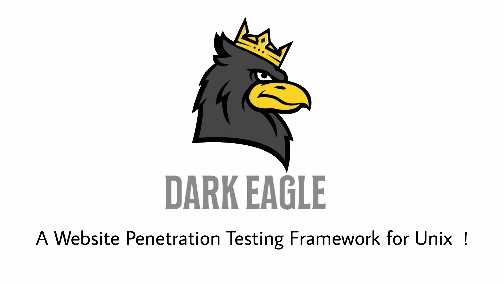

#  Dark Eagle !!
<br>
* `A web penetration testing framework developed for Linux and Termux!`

## Features !

01.  DNS Lookup</br>
02.  Reverse DNS Lookup</br>
03.  IP Locator</br>
04.  Subnet Lookup</br>
05.  Whois Lookup</br>
06.  Host Provider Lookup</br>
07.  Port Scanner</br>
08.  Page Link Finder</br>
09.  Traceroute</br>
10.  HTTP Header</br>
11.  SQLI Scanner</br>
12.  DDOS Attack</br>
13.  Subdomain Finder</br>
14.  Slowloris Attack</br>
15.  Admin Page Finder</br>
16.  Robots Finder</br>

## Disclaimer
*This tool is for educational purposes only !*

*I will not be responsible for any misuse*

## Usage
Clone it by
```bash
git clone https://github.com/anubhavanonymous/Dark_Eagle
```
Go to the Dark Eagle Directory
```bash
cd Dark_Eagle
```
Install requirements 
```bash
bash setup.sh
```
Run Dark Eagle 
```bash
bash eagle.sh
```
* `More features to be added soon !`
